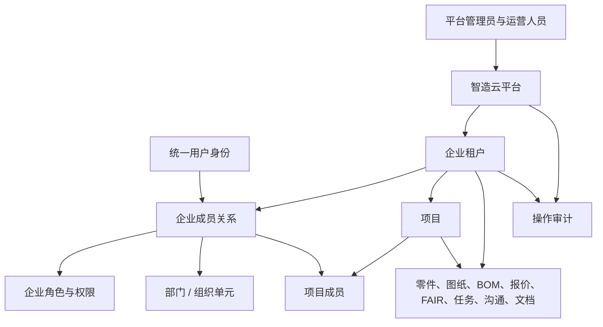

# 机加工 3D 零件智能报价助手：整体架构与企业体系

## 1. 架构结论

本系统应定义为一个面向机加工企业的多租户协同报价平台，而不是一个只有多组账号的单企业应用。

- 平台：运营方管理入驻企业、产品能力、平台人员和跨企业审计。
- 企业：一个独立租户，拥有自己的成员、组织结构、项目、零件、报价、文档、任务、质量和沟通数据。
- 用户：全局唯一的身份；用户通过企业成员关系进入一个或多个企业，而不是直接“属于”某一个企业。
- 权限：由“平台权限 + 企业角色 + 数据范围 + 项目成员关系”共同决定。功能模块开关只是企业订购/启用能力，不能代替权限控制。



## 2. 当前项目的实现基线

当前代码已经实现了一个可运行的组织级多租户基础，并完成了 P0 后端权限收口：

| 层级 | 当前实现 | 说明 |
| --- | --- | --- |
| 前端 | Vite 多页面工作台 | 企业工作台、平台后台、3D/BOM 工作台、ONLYOFFICE 编辑页。 |
| 服务端 | Node.js + Koa REST API | `server/app.js` 负责认证、组织切换、业务 API、文件回调。 |
| 数据 | SQLite | `server/db.js` 定义组织、账号、成员、会话及业务表。 |
| 文件与解析 | 本地/服务器文件存储 + ONLYOFFICE + 浏览器端 CAD 解析 | STEP/PDF 解析优先在浏览器执行；Office 文件按组织目录保存。 |
| 租户隔离 | `organization_id` | 项目、零件、报价、FAIR、任务、会话、消息、附件、文档、审计均带组织标识，并以当前会话组织查询。 |
| 后端授权 | 统一 `authorize` 策略 | 业务接口按企业角色、模块开关和项目成员关系校验；拒绝结果可区分角色、模块和项目范围。 |

现有关键数据关系如下：

```text
users --< memberships >-- organizations --< organization_modules
  |             |                    |
  |             +-- role             +-- projects --< project_members
  |                                  +-- parts / quotes / FAIR / tasks / conversations / documents
  +-- platform_admins                +-- audit_events

sessions = user_id + organization_id + expires_at
```

当前企业工作台模块包括项目管理、我的任务、零件中心、制表中心、BOM 报价助手、项目沟通、企业聊天和统计。平台后台包括平台总览、企业管理、平台用户视图和平台审计。

当前已实现的默认角色为 `owner`、`admin`、`engineer`、`qa` 和 `viewer`。`owner/admin` 具有企业全项目范围；其他角色必须被加入 `project_members` 才能读取或操作项目资源。`projects`、`workspace`、`bom`、`parts`、`communication`、`chat`、`tasks`、`stats` 模块在 API 层强制生效。项目成员可由企业所有者或管理员通过 `GET/POST /api/projects/:projectId/members` 查看和维护。

## 3. 平台体系

平台体系服务于产品运营，不参与企业的日常加工业务。平台权限必须和企业权限完全分离。

### 3.1 平台对象

| 对象 | 责任 | 必需状态/字段 |
| --- | --- | --- |
| 平台用户 | 运营、支持、审计、技术运维人员 | 身份、状态、平台角色、最后登录、MFA 状态。 |
| 企业租户 | 一个独立企业工作空间 | 名称、统一社会信用代码、企业标识、行业、联系人、状态、数据区域、创建时间。 |
| 企业能力包 | 企业已启用的产品能力 | 模块、版本、配额、生效与到期时间、状态。 |
| 平台审计 | 平台侧高风险行为留痕 | 操作者、目标企业、动作、前后值、来源 IP、时间、结果。 |

### 3.2 平台角色

| 角色 | 权限边界 |
| --- | --- |
| `platform_owner` | 平台最高权限；管理平台管理员、企业生命周期、产品能力和安全配置。 |
| `platform_operator` | 创建和维护企业、配置企业能力、查看运营数据；不读取企业图纸和报价明细。 |
| `platform_support` | 经企业授权后限时进入企业进行支持；全程审计，默认只读。 |
| `platform_auditor` | 查看审计与合规报表；不修改业务数据。 |

平台管理员进入企业空间时，必须产生“受控代理会话”：记录授权来源、进入原因、可用时长、只读/可写范围和全部操作。不能将平台管理员等同于企业所有者。

## 4. 企业体系

### 4.1 企业是租户边界

企业是数据隔离、成员管理、功能启用、审计归属和业务配置的最小边界。所有企业业务表均必须持有不可为空的 `organization_id`，所有读取、写入、关联校验和文件访问都必须从已认证会话中取得该值，不接受客户端传入的租户标识作为授权依据。

企业建议有以下生命周期：

```text
草稿 -> 待启用 -> 正常 -> 暂停 -> 已关闭 -> 已删除/归档
```

- `草稿`：创建企业资料但尚未交付使用。
- `待启用`：已完成企业管理员邀请，等待首位所有者激活。
- `正常`：允许登录和正常业务操作。
- `暂停`：保留数据且只读或禁止登录，用于欠费、风控或合同暂停。
- `已关闭`：停止日常业务，仅允许导出和审计。
- `已删除/归档`：按数据保留策略处理，禁止恢复性写入。

### 4.2 企业主数据

`organizations` 不应只保留 `name` 和 `slug`。建议补充：

| 领域 | 推荐字段 |
| --- | --- |
| 基本资料 | 法定名称、简称、统一社会信用代码、企业类型、行业、所在地、时区、语言。 |
| 经营配置 | 货币、税率、报价编号规则、单位制、工作日历、默认工艺/材料库。 |
| 组织管理 | 企业状态、首位所有者、创建来源、开通时间、关闭时间。 |
| 安全策略 | SSO 配置、MFA 要求、密码策略、会话时长、IP 白名单、数据保留期限。 |
| 存储与集成 | 文件存储配额、对象存储桶、ERP/MES/CRM 集成配置、Webhook。 |

### 4.3 企业组织结构

成员不应只用一个角色字段承载组织关系。建议新增：

```text
organization_units
  id, organization_id, parent_id, name, type, manager_membership_id, path, status

positions
  id, organization_id, organization_unit_id, name, code, status

membership_positions
  membership_id, position_id, is_primary
```

组织单元可覆盖销售、报价、工艺、生产、质量、采购、财务及管理层。`parent_id + path` 支持树形结构和部门范围授权。部门不是安全边界本身，但可作为“本部门数据”的授权条件。

### 4.4 企业外部主体

客户、供应商、外协厂和物流方不应直接建模成企业内部成员。应使用企业拥有的合作方模型：

```text
partners -> partner_contacts -> external_collaborators
```

外部协作者仅被授予指定项目、指定文件或指定询报价的访问权，默认不能浏览企业成员、全量项目、成本明细或企业聊天。

## 5. 用户与成员体系

### 5.1 分清用户与成员

| 概念 | 定义 | 典型字段 |
| --- | --- | --- |
| 用户 `user` | 平台全局唯一的登录身份 | 用户名/手机号/邮箱、姓名、凭据、MFA、账号状态。 |
| 企业成员 `membership` | 用户加入某个企业后的工作身份 | 企业、用户、成员状态、入职时间、部门、岗位、角色。 |
| 项目成员 `project_membership` | 企业成员参与某项目的授权关系 | 项目、成员、项目角色、数据范围、加入/退出时间。 |
| 邀请 `invitation` | 尚未被接受的成员加入流程 | 受邀地址、企业、预设角色、有效期、状态、邀请人。 |

一个用户可以加入多个企业，每一个企业成员关系独立设置角色、部门、状态与数据范围。登录后应显示“选择企业”或最近企业；会话中明确绑定当前企业。

### 5.2 成员状态

```text
邀请中 -> 已激活 -> 已停用 -> 已离职/移除
```

成员移除不得删除业务历史。项目、报价、审计、任务上的操作者和负责人需要保留快照名称与不可变 ID；移除后只撤销未来访问权。

### 5.3 当前系统与目标的差异

当前 `users`、`memberships`、`platform_admins` 和 `sessions` 已具备上述基础形态，但目前“邀请成员”实质上是管理员直接创建用户和临时密码。正式方案应改为一次性、带过期时间的邀请链接，首次登录强制设置密码并可选 MFA；账号禁用、密码重置、成员移除、成员跨企业加入和登录设备管理也应成为独立能力。

## 6. 权限模型

### 6.1 三种概念必须分离

| 概念 | 解决的问题 | 示例 |
| --- | --- | --- |
| 企业能力/模块开关 | 这个企业是否购买或启用功能 | 是否启用 BOM 报价助手。 |
| 角色权限 | 某成员能执行什么动作 | 是否能审批报价、邀请成员、删除文件。 |
| 数据范围 | 某成员能操作哪些数据 | 全企业、所属部门、参与项目、本人创建、仅被分配任务。 |

因此，模块关闭时所有关联 API 都拒绝访问；模块开启后，还必须通过动作权限和数据范围校验。前端隐藏导航仅改善体验，不能作为安全策略。

### 6.2 推荐的企业默认角色

| 角色 | 核心职责 | 默认数据范围 |
| --- | --- | --- |
| `owner` | 企业所有权、最终安全与配置责任 | 全企业。 |
| `org_admin` | 成员、部门、角色、企业配置 | 全企业；不天然获得报价审批。 |
| `sales` | 客户询盘、项目立项、对外报价 | 自己/所在部门/参与项目。 |
| `quote_engineer` | 成本核算、BOM、报价草稿 | 参与项目。 |
| `process_engineer` | 3D 模型、工艺路线、零件资料 | 参与项目。 |
| `production` | 排产、生产任务、交付状态 | 被授权项目/生产单元。 |
| `qa` | FAIR、检验、质量放行 | 被授权项目。 |
| `finance_approver` | 报价金额、利润和最终审批 | 被授权项目或全企业。 |
| `project_manager` | 项目成员、任务、进度和项目沟通 | 自己管理/参与项目。 |
| `viewer` | 只读查阅 | 被显式授予的范围。 |
| `external_collaborator` | 客户/供应商协同 | 单个项目或指定资源。 |

角色不应在代码中永久写死。建议使用 `roles`、`permissions`、`role_permissions` 和 `membership_roles` 表；在首期保留上述默认角色，再允许企业创建自定义角色。权限命名采用资源-动作形式，例如：

```text
organization.member.invite
project.create
project.member.manage
part.write
quote.read_cost
quote.edit
quote.approve
fair.verify
document.delete
audit.read
```

### 6.3 数据范围和项目级授权

报价成本、客户图纸、质量报告不应因为“同属一个企业”而被所有成员默认读取。建议：

1. 企业成员只获得进入企业的基础资格。
2. 项目创建时建立项目成员列表，并为项目负责人、报价、工艺、质量、生产等分配项目角色。
3. 每个请求同时校验：企业身份、模块启用、动作权限、目标资源所属企业、项目成员关系和字段级敏感权限。
4. 高敏感字段，如成本价、毛利、客户联系方式、下载原始图纸，使用单独权限控制。

后端鉴权应收敛为统一策略：

```text
authorize(session, permission, resource)
  = 企业状态正常
  AND 模块已启用
  AND 成员状态已激活
  AND 角色拥有 permission
  AND resource.organization_id == session.organization_id
  AND 数据范围满足（企业 / 部门 / 项目 / 本人）
```

## 7. 业务域模型

企业内部的业务主链建议为：

```text
客户询盘
  -> 项目
  -> 图纸/3D 模型与零件
  -> 工艺、材料与 BOM
  -> 成本核算与报价版本
  -> 报价审批/对外发送
  -> 订单与排产
  -> 加工、FAIR/检验
  -> 发货、交付、归档
```

每个业务对象至少包含：`id`、`organization_id`、`created_by`、`created_at`、`updated_at`、状态、版本号和审计关联。对报价、图纸、BOM、FAIR 等需要可追溯的对象，应增加不可变版本表，而不是直接覆盖历史版本。

当前已落地的对象包括项目、零件、文件、Office 文档、报价与明细、FAIR 检验项、任务/子任务/评论、会话/消息/附件和审计。订单、客户/供应商、工艺路线、报价审批流、生产排程、交付和版本化尚未形成持久化领域模型。

## 8. 现状风险与必须修正项

P0 已完成以下安全边界：

1. 项目、零件、报价、FAIR、任务、会话、聊天附件和文档接口统一执行服务端角色权限、模块开关和项目成员校验。
2. `project_members` 已落库并回填既有项目创建者；项目创建自动加入创建者，企业管理员可维护项目成员。
3. 文档下载、编辑配置、回收站和项目沟通均按所属项目再次校验；项目工作台只返回当前角色拥有读取权限的子资源，避免经聚合接口泄露报价或审计信息。
4. 任务负责人必须具备项目访问权；非管理员只能处理分配给自己的独立任务。
5. 端到端回归覆盖角色拒绝、模块关闭、项目未加入、项目成员授权、FAIR 写入和工作台报价防泄漏。

仍需在后续阶段完成：

1. 企业/成员状态、成员移除、邀请令牌、首次登录改密、密码重置、MFA、登录限流和会话撤销。
2. 可配置 RBAC、部门/本人范围、项目角色的动作权限、报价成本字段级权限及审批流。
3. 平台支持人员的受控代理会话、短期文件签名/轮换、访问日志、病毒扫描和对象存储。
4. PostgreSQL、多实例部署、备份恢复、监控告警和数据保留策略。

## 9. 建议的落地顺序

| 阶段 | 目标 | 交付内容 |
| --- | --- | --- |
| P0：权限收口 | 已完成当前接口的访问控制基线 | 统一 `authorize`、模块 API 拦截、默认角色矩阵、项目成员范围、聚合防泄漏和回归测试。 |
| P1：企业与成员管理 | 建立可运营的企业体系 | 企业生命周期、邀请/激活/移除、密码与会话管理、企业资料、部门与岗位。 |
| P2：项目数据权限 | 控制图纸和报价等敏感数据 | 项目成员、项目角色、部门/本人范围、成本与报价审批权限、访问审计。 |
| P3：制造业务闭环 | 从报价工具扩展为经营协同系统 | 客户/供应商、订单、工艺路线、审批流、排产、交付、版本与归档。 |
| P4：企业级部署 | 支持正式客户与规模化运行 | PostgreSQL、对象存储、队列、备份恢复、SSO/MFA、监控告警、数据保留与合规。 |

P0 已让当前业务接口具备可信的角色、模块和项目范围隔离；下一步应优先进入 P1 的成员生命周期，再进入 P2 的可配置项目角色和字段级数据权限。

## 10. 本项目的目标边界

最终的访问链路应是：

```text
用户登录
  -> 选择/恢复企业上下文
  -> 验证企业与成员状态
  -> 验证企业已启用模块
  -> 验证角色动作权限
  -> 验证部门/项目/本人数据范围
  -> 执行业务动作
  -> 写入不可篡改的审计事件
```

其中，企业负责“谁在同一个工作空间”，项目负责“谁可以参与这项业务”，权限负责“参与者可以做什么”，审计负责“谁在何时做了什么”。这四个边界明确后，用户体系、企业体系和报价业务才能继续扩展而不失控。
